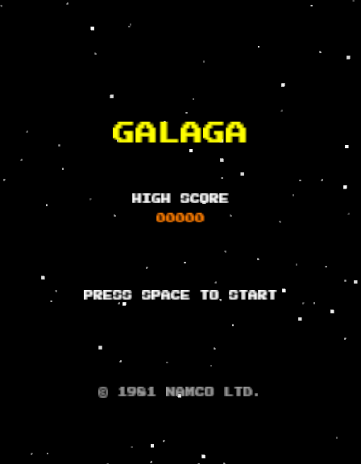
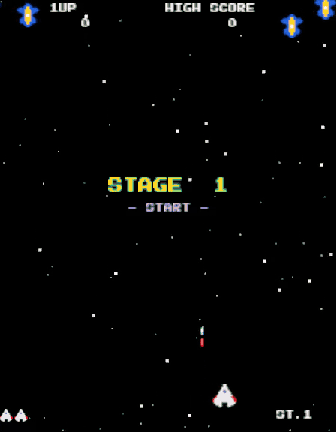
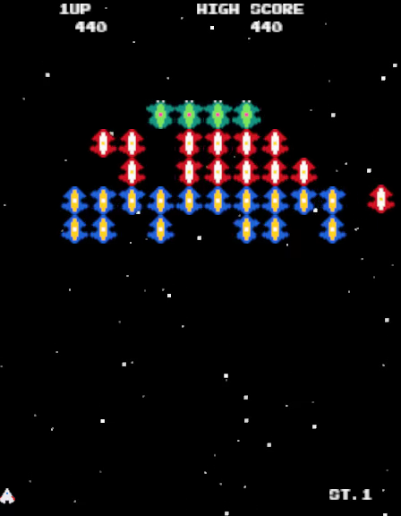
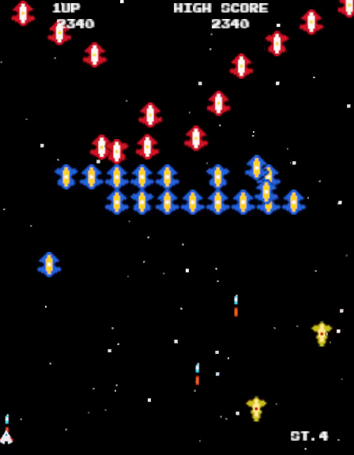
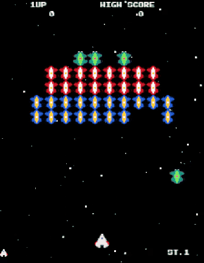
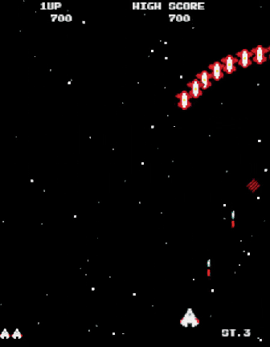
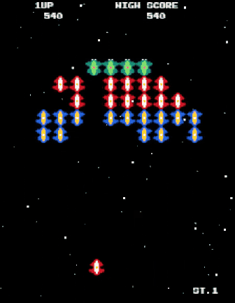

<div align="center">



# G A L A G A

### *The swarm is back. 1981 called, and it brought forty friends.*

A loving, from-scratch recreation of Namco's legendary arcade shooter,<br>
rebuilt in **Rust** and the **Bevy** game engine. Dive-bombing Bees, Butterfly squadrons,<br>
tractor-beaming Bosses and the dual fighter, with no emulator and no ROMs.




</div>

---

## 🕹️ Press Start

The screen goes black. A starfield starts to scroll. Then the swarm arrives: Bees first, peeling in from the edges of space in long looping chains, then the red Butterflies, and finally the four green **Boss Galagas** settling into the top row. They hang there and sway in formation. Then one breaks rank and dives straight at you.

You've got a single white fighter, two bullets on screen at a time, and very little room for mistakes.

---

## 👾 Meet the Swarm

| | Enemy | In formation | Diving | Notes |
|:-:|---|:-:|:-:|---|
| 🐝 | **Bee** (Zako) | 50 | 100 | Fast and plentiful. Dive-bombs from the sides and loops around off-screen. |
| 🦋 | **Butterfly** (Goei) | 80 | 160 | Swoops hard across the player zone and zips back up the far side. |
| 👑 | **Boss Galaga** | 150 | 400 | Takes **two hits**. Turns from green to purple when damaged. Owns the tractor beam. |
| 🦂 | **Splitters** | 100 each | — | From stage 4, one marked Bee bursts into three Scorpions, Stingrays or Galaxian Flagships. Shoot all three for a **1,000 / 2,000 / 3,000** bonus. |

Bonus lives at **20,000** points, then every **70,000** after that.

<div align="center">

&nbsp;&nbsp;

</div>

---

## 🔵 The Tractor Beam

This is the mechanic Galaga is known for. A Boss swoops down to mid-screen and opens a blue cone of light. If you're under it, you get pulled up, your ship turns red, and the Boss carries it back to the formation.

Losing the ship is not the end of it. **Shoot the Boss while it's diving** and your captured ship is freed. It docks beside you and you're flying a **dual fighter**: two ships, twice the firepower and twice the hitbox. Hit the Boss while it's sitting in formation instead and the captured ship is lost for good.

If you stay out of the beam, the Boss waits a few seconds and then flies home.

<div align="center">

</div>

---

## ✨ Challenging Stages

Stage 3, then every fourth stage after it (7, 11, 15…). Nobody shoots at you. Forty enemies fly in five choreographed waves: straight lines, wide arcs and a figure-eight of Bosses. Shoot as many as you can. Hit **all 40** and you get a **10,000 point** perfect bonus.

<div align="center">

&nbsp;&nbsp;

</div>

---

## 🎮 Controls

| Key | Action |
|-----|--------|
| `←` `→` / `A` `D` | Move |
| `Space` | Fire (also starts the game) |
| `Esc` | Pause / resume, including during challenging stages |
| `↑` `↓` *(paused)* | Choose SFX or music volume |
| `←` `→` *(paused)* | Adjust volume |

---

## 📜 A Short History of the Swarm

**1978: the invasion begins.** Taito's *Space Invaders* fills Japanese arcades with marching aliens. Every manufacturer wants a piece of it.

**1979: Galaxian.** Namco answers with *Galaxian*, which puts full RGB color on screen and has aliens that break formation and **dive at you** in swooping arcs. It's a hit, but you only get one bullet on screen at a time.

**1981: Galaga.** Designer **Shigeru Yokoyama** and the Namco team build the sequel around one question: what if the enemies could take something from you? The answer was the tractor beam, and the dual fighter that comes out of it. They also added two shots on screen, bonus stages, enemies that transform mid-stage, and an attract mode that teaches you the beam trick before you've put in a coin. Inside the cabinet, **three Z80 CPUs** run in parallel, and Namco's custom waveform sound chip makes the "pew" and that rising capture tune. Midway distributed it in North America and it became one of the biggest games of the golden age.

**The bugs became part of the legend.** The original ROM has a famous *no-fire bug*: if you play stage one a certain way and wait long enough, the Bees stop shooting for the rest of the game. Its stage counter is a single byte, so surviving past stage 255 rolls it over to "stage 0", with unpredictable results.

**It refused to die.** Sequels followed (*Gaplus* in 1984, *Galaga '88* in 1987, *Galaga Legions* in 2008), along with home ports on nearly every platform. Galaga turns up in movies too: Matthew Broderick plays one in the *WarGames* arcade, and the Avengers' helicarrier has a S.H.I.E.L.D. agent who thinks nobody notices him sneaking in a game. The *Ms. Pac-Man/Galaga: Class of 1981* combo cabinet still shows up in bowling alleys, pizza places and bars today.

More than forty years later, it's still worth putting in another coin.

---

## 🚀 Build & Run

You need [Rust](https://rustup.rs/) (2024 edition).

```bash
git clone https://github.com/ChrisBrooksbank/galaga.git
cd galaga
cargo run
```

> **Heads up:** the checked-in `.cargo/config.toml` targets **Windows (MinGW + lld)**. On Linux or macOS, override the target and output dir:
>
> ```bash
> CARGO_TARGET_DIR=target cargo run --target x86_64-unknown-linux-gnu   # or aarch64-apple-darwin
> ```
>
> On Linux, Bevy also needs the usual system libraries (Debian/Ubuntu):
> `sudo apt install libasound2-dev libudev-dev libwayland-dev libxkbcommon-dev`

```bash
cargo test     # formation, dive paths, scoring, tractor-beam logic
cargo clippy   # lint
```

---

## 🧬 Under the Hood

The game uses Bevy's ECS. Every Bee is an entity, every behaviour is a system, and a state machine (`Loading → Menu → Playing ⇄ Paused / ChallengingStage → GameOver`) keeps track of where you are.

```
src/
  main.rs         # App setup, state machine, system registration
  constants.rs    # Every tunable number: speeds, scores, timings, probabilities
  player/         # Movement, shooting, death & respawn, dual fighter
  enemies/        # Formation grid, entry patterns, dive AI, tractor beam, splitters
  collision/      # AABB bullet / body collisions
  waves/          # Stage flow, difficulty curve, challenging stages
  scoring/        # Points, high score, extra lives
  effects/        # Parallax starfield, explosions
  ui/             # Title, HUD, stage intro, pause menu, game over
  audio/          # Chiptune music + SFX via bevy_kira_audio
assets/           # Pixel-art sprite sheets, WAV/OGG audio, Press Start 2P font
```

The difficulty ramps up every stage: dive speed, enemy fire rate, attack frequency and the number of simultaneous divers all increase, so the later stages get hectic. Want to change how it plays? Everything is in [`src/constants.rs`](src/constants.rs).

**Built with:** [Bevy 0.18](https://bevyengine.org/) · [bevy_kira_audio](https://github.com/NiklasEi/bevy_kira_audio) · [bevy_asset_loader](https://github.com/NiklasEi/bevy_asset_loader)

---

<div align="center">

**GAME OVER?** Not yet.

*Galaga is a trademark of Bandai Namco Entertainment. This is a non-commercial fan recreation for educational purposes. All code is original.*

MIT License

</div>
